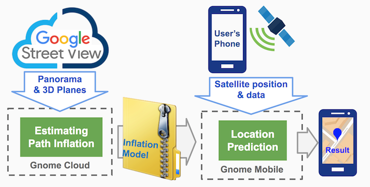

# Gnome
This is the basic version of "Gnome: A Practical Approach to NLOS Mitigation for GPS Positioning in Smartphones". Some functions are not optimized. We will keep updating the repo.

## Requirement
- Python 2.7.x
- OS X or Ubuntu 
- Android 7+

## Code Structure 
- `cloud/`: Cloud part of Gnome. It downloads data from Google Street View in the specified area, and compute GPS path inflation. 
- `mobile/`: Mobile part of Gnome. It takes input from Android GPS metadata and the path inflation model from cloud, and computes the adjusted location. 

## Workflow


## Run Cloud
- Go to `cloud/` dir, fill `alps/config/query_google_key.info` with your own google key. 
- Run `python run.py lat_bottom lon_left lat_top lon_right`. The last four parameters specifies the region where Gnome generates the path inflation model. The output is written in `inflation.pkl` *Sample command: `python run.py 34.045175 -118.260346 34.049438 -118.256356`*

## Run Mobile
The mobile part of Gnome is running as a python library. Your code should include the `Gnome` class in `mobile/main.py` and `GPSmeta` in `mobile.meta.py`. Here is the example:

```
from mobile.main import Gnome
from mobile.meta import GPSmeta

gnome = Gnome(path_to_inflation_model)
gnome_meta = GPSmeta()					# input path to gnss logger file (optional)

while reading_gps:
	position_adjusted = Gnome.update(your_own_data)		# pass data from your own app
	position_adjusted = Gnome.update(gnome_meta.read())	# pass data from gnss logger file 
	 
```

- `Gnome` is the main object to compute the new location. Use its `update` function to get new location reading
- `GPSmeta` contains raw GPS measurement like C/N0, Pseudorange rate, clock, etc. Please read `mobile/meta.py` to check how to initiate GPSmeta. You can get the raw GPS measurement data from Android APIs in your app. For API details please read the source code of [Android GNSS Logger](https://github.com/google/gps-measurement-tools/tree/master/GNSSLogger). `GPSmeta` also enables you to initiate the meta object with the output file of Android GNSS logger. The Android version of Gnome mobile will come in future. 

